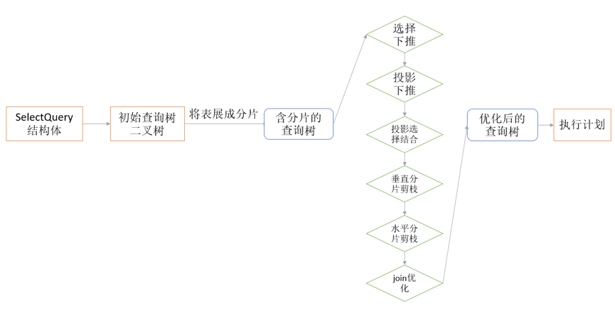
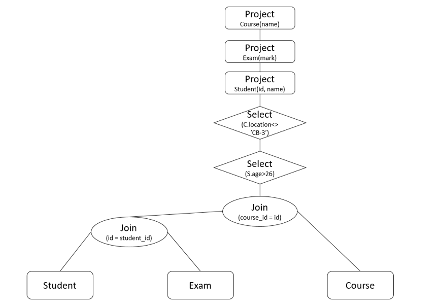
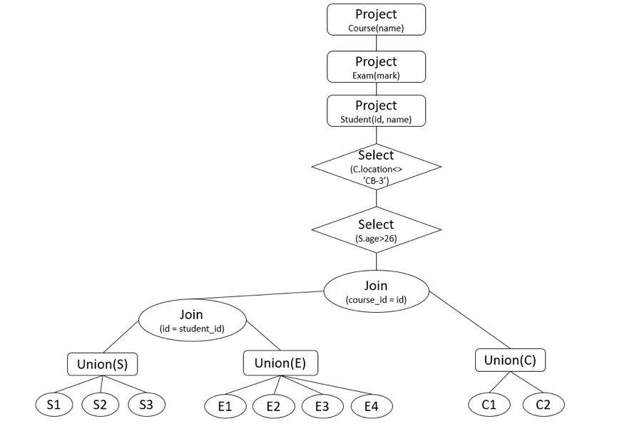
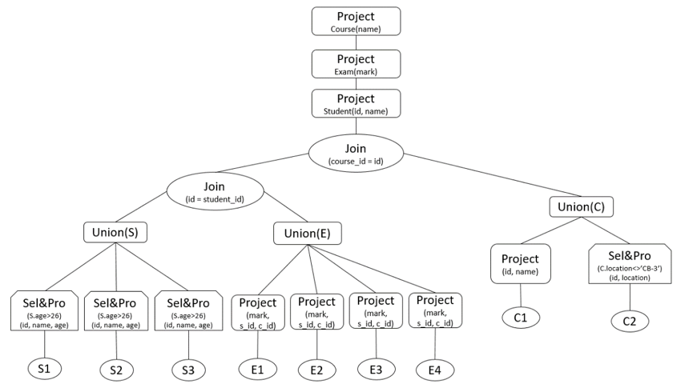

# DDB 分布式数据库

基于C++ 实现的分布式数据库，底层采用MySQL数据库，使用RPC远程过程调用进行网络的通信

可以部署在Ubuntu16.04上

## Feature

1. 使用正则表达式解析SQL语句，以及分片的信息等
2. 使用Etcd进行元数据，以及GDD（全局字典）的管理
3. 基于数据分片的信息生成的SQL操作语句，包括 create、insert、delete ...
4. 能够根据分片信息对select 中的join，projection，进行投影下推，剪枝，join重新排序，条件上移等优化
5. 根据输入的sql语句能够查询出结果。

## Deployment

```bash
cd client
mkdir build && cd build
cmake ../
make
./client 8080
```

<font color=red>提示</font>

本项目的CMakelist写的不太好，因此大家需要根据项目中引入的库，自行链接，其中用到的库如下：

- libmysqlcppconn7
- rpclib
- libcurl
- libjson
- boost

## Benchmark

#### Define site

这里使用三台机器，定义了四个站点，ip和端口以及数据库的名称如下：

```sql
define site 1 db1 10.77.40.212:8080
define site 2 db2 10.79.10.210:8080
define site 3 db3 10.41.46.184:8080
define site 4 db4 10.41.46.184:8081
```

#### Create table

```SQL
create table Student(id int key,name char(25),sex char(1),age int,degree int);
create table Teacher(id int key,name char(25),title int);
create table Course(id int key,name char(80),location char(8),credit_hour int,teacher_id int);
create table Exam(student_id int,course_id int,mark int);
```

#### Define fragment

```SQL
frag Student id < 1050000 db1 id >= 1050000 and id < 1100000 db2 id >= 1100000 db3;
frag Teacher id < 2010000 and title <> 3 db1 id < 2010000 and title = 3 db2 id >= 2010000 and title <> 3 db3 id >= 2010000 and title = 3 db4;
frag Course (id,name) db1 (id,location,credit_hour,teacher_id) db2;
frag Exam student_id < 1070000 and course_id < 301200 db1 student_id < 1070000 and course_id >= 301200 db2 student_id >= 1070000 and course_id < 301200 db3 student_id >= 1070000 and course_id >= 301200 db4;
```

#### Insert statement

```SQL
insert into Student values(1000001,'xiao ming','M',20,1);
insert into Teacher values(2900010,'Santa Claus',2);
insert into Teacher values(2000001,'St. Nicholas',1);
insert into Course values(3900001,'Defence Against Dark Arts','CB-3',4,200001);
insert into Exam values(1900001,3900001,96);
```

#### Delete statement

```SQL
delete from Teacher where title = 1;
delete from Teacher where id >= 2900010 and title = 2;
delete from Student where id = 1000001;
delete from Course where location = 'CB-3';
delete from Exam;
```

#### Load statement

```SQL
load Student /var/lib/mysql-files/data/student.tsv
load Teacher /var/lib/mysql-files/data/teacher.tsv
load Course /var/lib/mysql-files/data/course.tsv
load Exam /var/lib/mysql-files/data/exam.tsv
```

#### Select statement

```SQL
select * from Student;
select Course.name from Course;
select * from Course where Course.credit_hour>2 and Course.location='CB-3';
select Exam.course_id,Exam.mark from Exam;
select Course.name, Course.credit_hour, Teacher.name from Course, Teacher where Course.teacher_id=Teacher.id and Course.credit_hour>2 and Teacher.title=3;
select Student.name,Exam.mark from Student,Exam where Student.id=Exam.student_id;
select Student.id,Student.name,Exam.mark,Course.name from Student,Exam,Course where Student.id=Exam.student_id and Exam.course_id=Course.id and Student.age>26 and Course.location<>'CB-3';
```

## 查询优化

该部分由[@jywangwayne](https://github.com/jywangwayne)完成，感谢

#### 优化过程



例如

```SQL
Select Student.id, Student.name, Exam.mark, Course.name from Student, Exam, Course where Student.id = Exam.student_id and Exam.course_id = Course.id and Student.age>26 and Course.location<>’CB-3’; 
```

#### 生成查询树




#### 展开后的分片信息

由etcd获取了表的信息，下一步将表节点（叶子结点）转换成分片的形式。此时树不再是二叉树，所以用的顺序存储方式，树的修改如下：

1. select节点和project节点不变。
2. 如果join的节点是一个表，那么加上一个虚拟的union节点，（并不是后期真正的union，是一个虚拟节点），union节点的父节点就是对应的join节点，子节点是分片。
3. 表的结点删除（代码中的做法是让其父节点为-1）。
4.  无论是垂直分片还是水平分片现阶段都用union节点表示，如果是垂直分片后期将union节点转换成join节点，如果是水平分片，后期将union节点保留。



#### 选择下推

